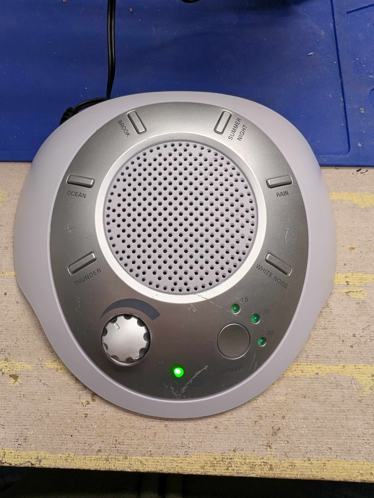
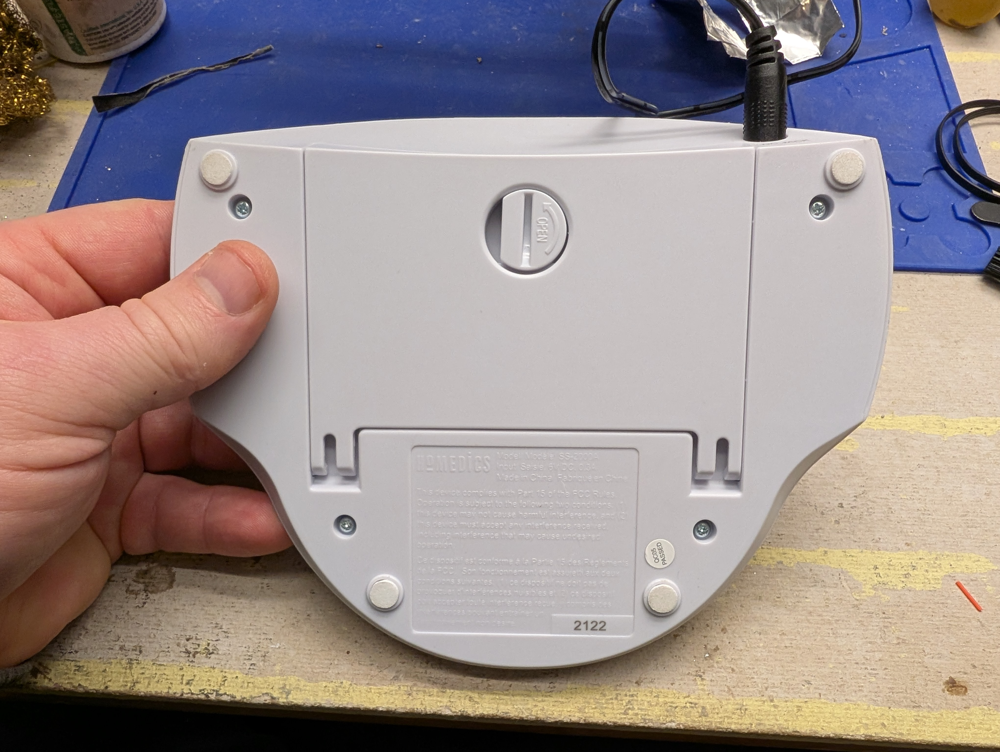
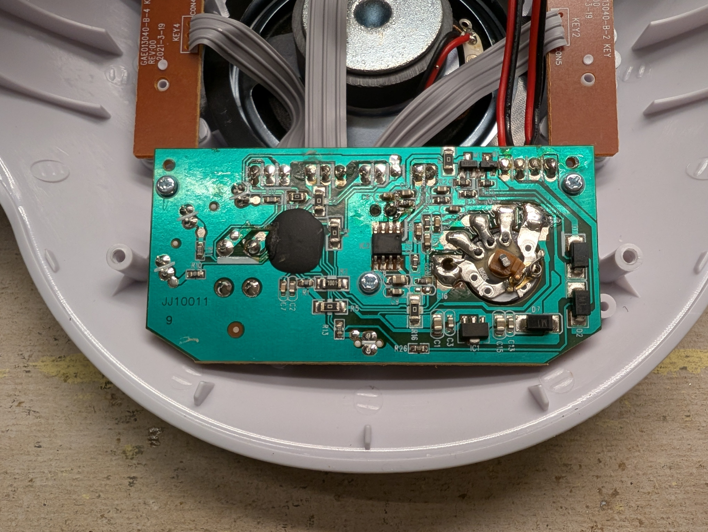
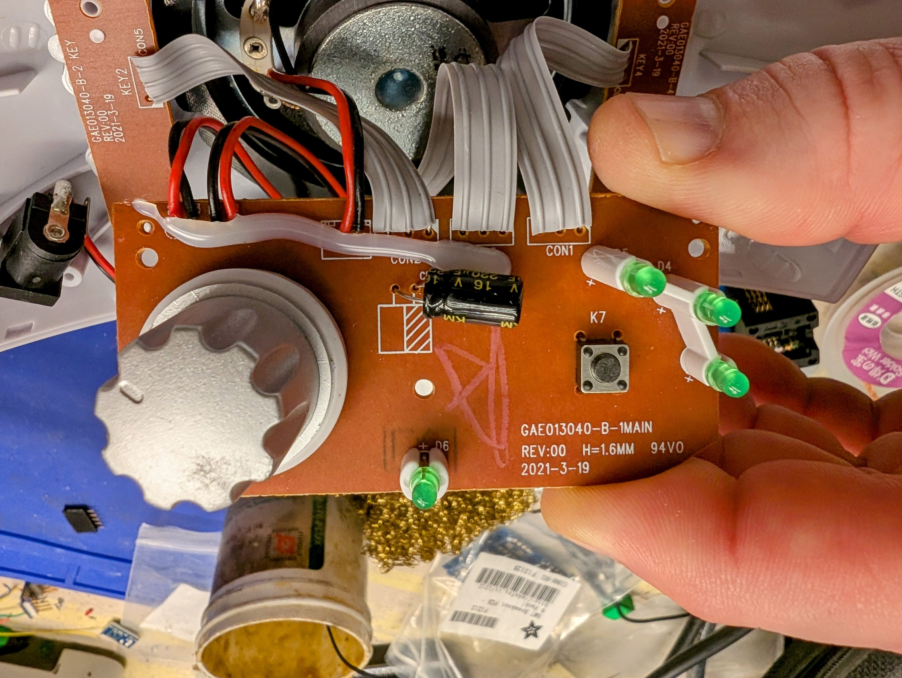
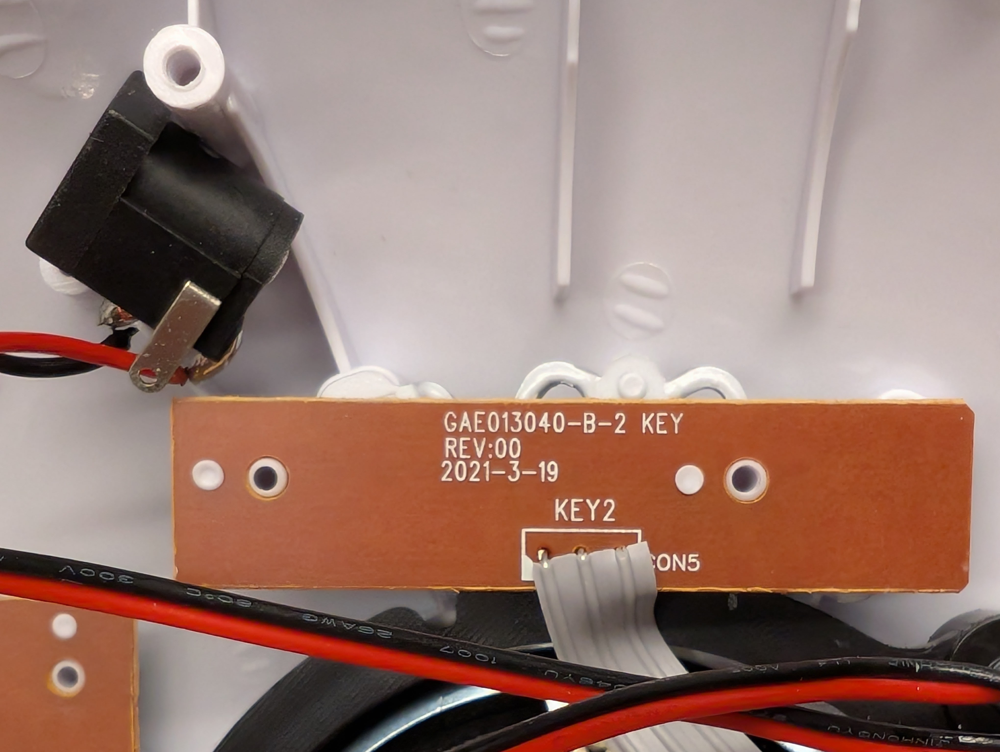
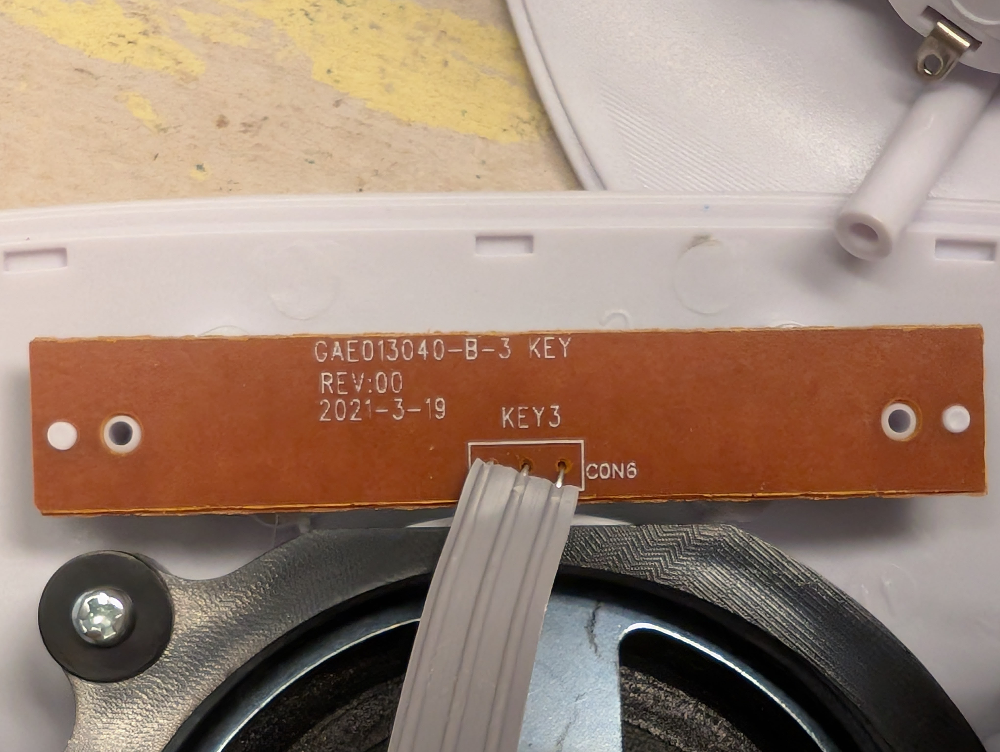
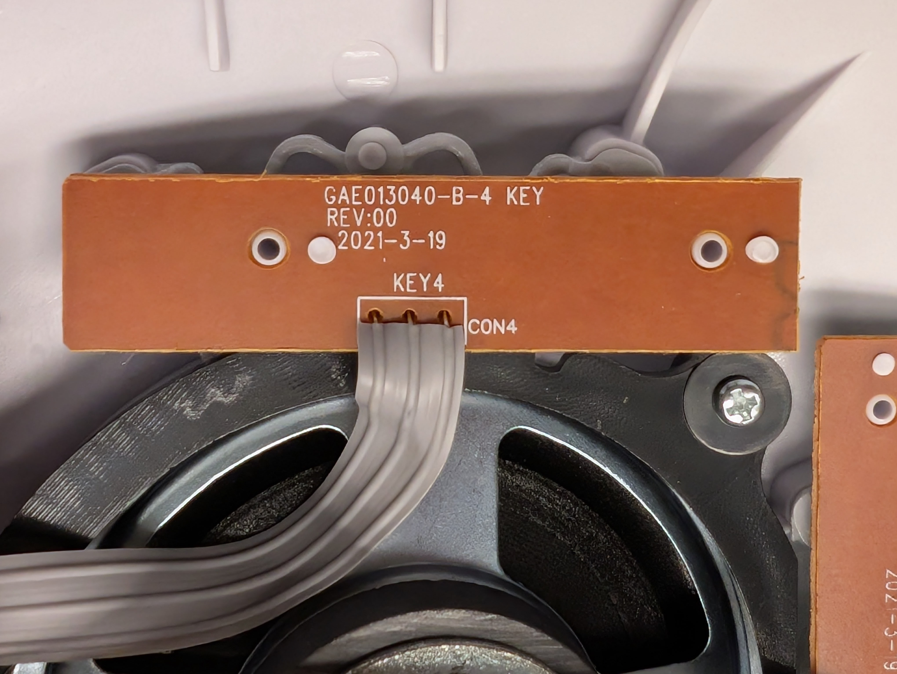
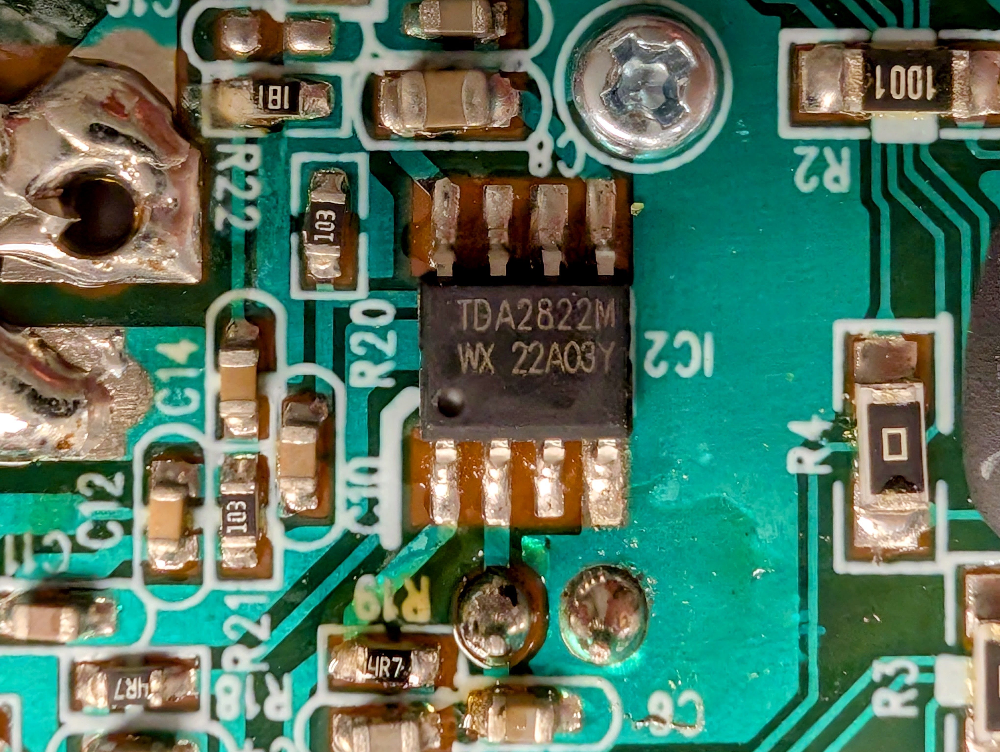
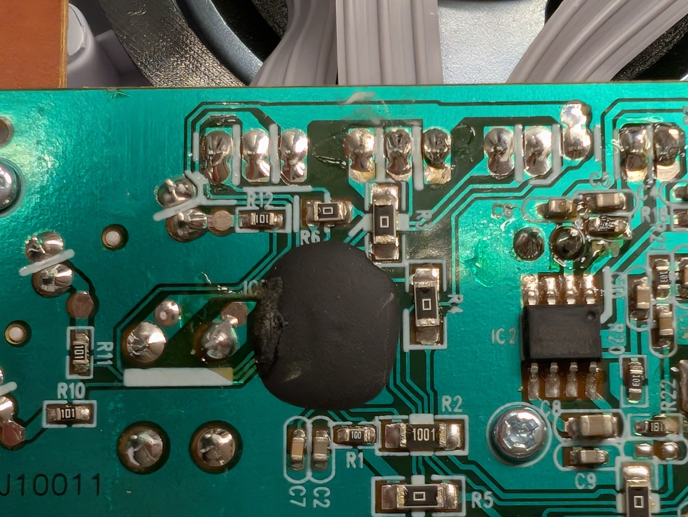

# HoMedics SoundSpa SS-2000A





## Checklist

- [ ] Reference materials
    - [ ] Manufacturer docs
    - [ ] Firmware updates
    - [ ] OpenWRT support
    - [ ] Pinouts
- [ ] Factory reset
- [ ] External documentation
- [ ] Case opened
- [ ] Internal documentation
- [ ] Dumped ROM .reset
- [ ] Extracted FW parts, inspected
- [ ] Factory reset with boot
- [ ] Dumped ROM regular
- [ ] Booted
- [ ] Root shell
- [ ] Pull stats
    - [ ] `uname -a`
    - [ ] `busybox --help`
    - [ ] `cat /proc/mtd`
- [ ] 

## Critical Info

```text
Serial no.: 2122
Input: 6V DC 0.3A
```

## Reference material:

* [Manufacturer page](https://www.homedics.com/products/soundspa?variant=45162967236793)

## Inside

Phillips-head screws

### Boards

One mainboard, five smaller ones for I/O:

#### Mainboard



#### Button Board 1



#### Button Board 2



#### Button Board 3



#### Button Board 4



### Chips

#### TDA2822M Dual Low-Voltage Audio Power Amplifier



https://www.st.com/resource/en/datasheet/cd00000134.pdf

#### Chip On Board



Holds many secrets.

### Conclusion: Meh

This thing doesn't seem very hackable.
If I got under that glob-top, I might find a chip I could work with,
but more likely not.
